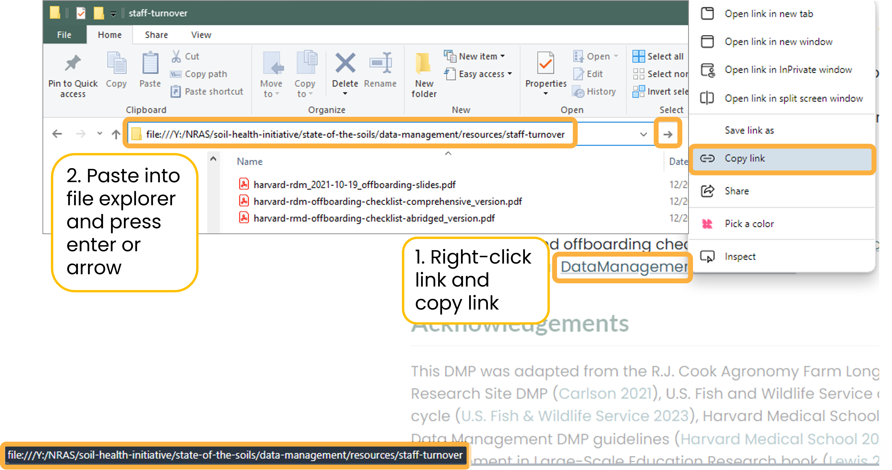

# Overview {.unnumbered}

:::: {.content-visible when-format="docx"}
::: callout-tip
**View this data management plan as an online book at
<https://wa-department-of-agriculture.github.io/washi-dmp/>.**
:::
::::

The [Washington Soil Health
Initiative](https://washingtonsoilhealthinitiative.com/) (WaSHI) is a
partnership between the Washington State Department of Agriculture (WSDA),
Washington State University (WSU), and the State Conservation Commission that
establishes a coordinated approach to healthy soils in Washington. Within WSDA,
this work is led by the Climate & Conservation Team, which supports a growing
portfolio of soil health, conservation, and climate-focused programs and
projects.

This data management plan (DMP) applies to data generated and managed by the
Climate & Conservation Team across multiple initiatives, including the Voluntary
Stewardship Program, Saving Tomorrow's Agriculture Resources, Nitrate Leaching
Reduction, Livestock Composting, and related climate and conservation efforts.

The DMP originally was developed to support the [State of the Soils
Assessment](https://washingtonsoilhealthinitiative.com/state-of-the-soils/)
(SOS), a statewide soil health monitoring program that collected nearly 1,200
soil samples and management surveys across 66 different cropping systems and all
39 counties in Washington. Following the conclusion of this effort, this DMP has
been revised to support the broader range of projects led by the Climate &
Conservation Team.

## Chapter outline

**This DMP is a living document to be continually reviewed and improved based on
lessons learned, new information, and collaborator feedback.**

@sec-data-management describes what data management is, why it is crucial to
achieve our data-driven goals, and how our data move through the data life
cycle.

@sec-formats-standards describes the various data formats we collect and manage.
[ISO standards](https://www.iso.org/standards.html) are also described for date
and geospatial data.

@sec-naming describes naming conventions, best practices, and examples for how
we name folders and files.

@sec-organization describes how we organize our folders into a hierarchical
structure.

@sec-storage describes where we store data, what our backup policies are, how we
protect our raw data, and how we use version control.

@sec-documentation describes how we record each element of the data life cycle
with project-level, dataset-level, and variable-level documents such as standard
operating procedures, readme files, data dictionaries, etc.

@sec-flow describes how data are generated, processed, and moved from start to
finish. Processes and tasks are grouped by pre, during, and post field season.

@sec-sharing describes how we protect producer privacy; how our data fits into
[WaTech data categories](https://watech.wa.gov/Categorizing-Data-State-Agency);
requirements and processes for maintaining confidentiality; and our data share
agreement, public access policies, and our preferred acknowledgements.

@sec-code-style-guide describes our recommended project structures,
code-specific naming conventions, script structures, and code style.

:::: {.content-visible when-format="docx"}
::: callout-important
## Links to shared drive folders and files

This DMP includes many links to folders and files on the shared drive, which are
only accessible to WSDA staff on the state network or remotely connected using
VPN.
:::
::::

:::: {.content-visible when-format="html"}
::: {.callout-important collapse="false"}
## Links to shared drive folders and files

This DMP includes many links to folders and files on the shared drive, which is
only accessible to WSDA staff on the state network or remotely connected using
VPN.

Google Chrome will allow you to open the links using the [Enable local file
links extension](chrome://extensions/?id=nikfmfgobenbhmocjaaboihbeocackld) that
should automatically be enabled by WSDA.

However, shared drive links are not accessible from this DMP when using Microsoft Edge.
Nothing happens when clicking on these links. To open the file or folder,
right-click on the hyperlink \> Copy link \> paste it into the search bar of
the file explorer \> press `Enter` or click the arrow.

{fig-alt="Screenshots of DMP outlining the process of right-clicking a hyperlink to a shared drive folder, copying the link, and then pasting it into the file explorer, and clicking enter."}
:::
::::

::: callout-warning
## GitHub links

If you are not logged into a GitHub account that is part of the WSDA organization
or has access to the `washi-sos` repository, GitHub links to specific scripts
will take you to a `404 not found` error page.
:::

## Roles and responsibilities

To maximize the benefits of effective data management, all WSDA personnel who
interact with Climate & Conservation Team data must familiarize themselves with
this DMP.

The Data Scientist, supported by the Senior Soil Scientist, is responsible for
providing guidance to staff working with data and ensuring the implementation of
this DMP. The Data Scientist is also responsible for reviewing and updating this
document annually, and as needed. Upon updates, the Data Scientist will
distribute this document to staff and commit the source code to the [GitHub
repository](https://github.com/WA-Department-of-Agriculture/washi-dmp).

## Staff turnover

When staff leave, they take their skills, institutional knowledge, and personal
understanding of their file management with them. Proper offboarding is
essential to ensure knowledge isn't lost, time isn't wasted trying to recreate
workflows, and projects keep moving.

Before the employee leaves, the Senior Soil Scientist and Data Scientist ensure
that:

-   Folders and files are moved from the employee's personal drive to the shared
    drive. They are named and organized according to [@sec-naming].
-   Workflows and specific processes the employee was responsible for are well
    documented.
-   Permission and ownership for the following are transferred to the
    appropriate remaining staff:
    -   [GitHub WSDA
        organization](https://github.com/WA-Department-of-Agriculture)
    -   ArcGIS data products and online groups
    -   Database credentials
    -   Box.com folders

More resources and off boarding checklists from [Harvard Research Data
Management](https://datamanagement.hms.harvard.edu/about/where-start/rdm-offboarding-checklist)
can be found in our [data-management shared
drive](Y:/NRAS/soil-health-initiative/data-management/resources/staff-turnover).

## Acknowledgements

This DMP was adapted from the R.J. Cook Agronomy Farm Long-Term Agroecological
Research Site DMP [@carlson2021], U.S. Fish and Wildlife Service data management
life cycle [@u.s.fishwildlifeservice2023], Harvard Medical School Longwood
Research Data Management DMP guidelines [@harvardmedicalschool2023], and the
Data Management in Large-Scale Education Research book [@lewis2023].
